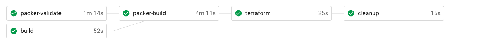

# devops_interview
This is a hands-on assessment of Infrastructure-as-Code (IaC), CI/CD, and public cloud providers. You may use GCP or AWS as the platform of your choice; you may use `gcloud deployment-manager`, `aws cloudformation`, or `terraform` command-line interface tools. Please do not spend more than 2 hours on this task. You're not expected to setup your own personal cloud account, but there should be enough configuration details so that deploying to a real cloud environment will theoretically work. Be prepared to justify your design.

## Setup:
1. Fork this repo into your own Github account
2. Add user `tonybenchsci` to your forked repo with read access
3. Setup a [free CircleCI accout](https://circleci.com/docs/2.0/first-steps/) and hook up your repo

## Background:
A simple Flask webserver that displays "Hello World from BenchSci!" runs on a Virtual Machine on the cloud. The VM that runs it has several firewall rules associated. The firewall rules are:
- Allow all egress
- Deny all ingress, but allow:
```
TCP Ports 80, 443 from everywhere on the internet
ICMP (ping) from  everywhere on the internet
TCP Port 22 from 104.154.0.0/15 (GOOGLE LLC)
Allow all tcp/udp internal traffic within the VPC
```

## The problem:
The above cloud-native application was manually configured using Web console UIs, and it was accidently deleted by a junior developer. None of the cloud firewall rules were captured in IaC, and neither is the VM configuration. Your assignment is to create the cloud resources in configuration files, and setup CI/CD to create/update the rules based on code changes in the master branch. This would allow arbitrary deploys of the application stack, resilient to incidents. It also allows a team of DevOps engineers to collaborate on new infrastructure definitions.

## Requirements:
- Complete `./circle/config.yml` file that installs CLI tools as needed, configures auth, performs basic sanity tests, and deploys resources.
- Configuration file(s) that define a VPC network that the VM lives in, Firewall rules / Security groups, and a single VM
- (Theoretically deployed) VM runs the python webserver defined in `app.py` on startup and any restarts
- (Theoretically deployed) Working public IP address to see "Hello World from BenchSci!" in a web browser
- Basic Documentation (README.md) and architecture diagram
- Avoid: Unnecessary abstractions in the form of configuration templates and/or modules

--------------------------
## Solution:

The webserver application is built and deployed to AWS by CircleCI. The state is stored on Terraform Cloud.

### Architecture / Design

The webserver is a Flask Python app, deployed within an EC2 instance. The EC2 instance is built by Packer, the resulting AMI template ID is saved in the `manifest.json` file that Packer outputs. Terraform takes the AMI ID as input and deploys it in an autoscaling group (ASG), behind an application load balancer (ALB). When Terraform updates the launch config for the ASG, it triggers a deployment of new EC2 instances, and deletes the old ones afterwards.

Using an autoscaling group allows the application to be resilient to incidents that would affect an AWS availability zone, and also allows to do a rolling deployment of new EC2 instances.

On commit, CircleCI runs `pytest` on the Flask application code. If that passes, it then triggers Packer to create an AMI. The AMI is configured by Ansible, which installs any prerequistes, the application itself, and configures the application to startup on boot with a systemd unit file. The AMI is tested with `goss` - a serverspec testing tool. If the goss tests pass, Packer will register the AMI as a template and will tag the AMI with the commit SHA from HEAD. The output of the build is stored in the `manifest.json` file, which is persisted to the CircleCI workspace. CircleCI will take the AMI ID from the `manifest.json` file, store it as an environment variable and pass it into Terraform as a variable. It will trigger a `terraform plan` in the circleci workspace to validate that the Terraform code is valid and can be theoretically deployed.

If this is a non-master branch, there is a step at the end to clean up the AMI and its associated snapshot to reduce storage costs - as all non-master branches are treated as dev/feature branches. If this is the `master` branch, it will deploy the infrastructure to the `prod` workspace. In this project, `master` is treated as production, the branch should be protected and all tests (`pytest`, `goss`, `terraform plan`) must pass before merging code into `master`. 

--------------------------

**Infrastructure Diagram**:


**Dev CI flow**:


**Master CI flow**:


### Setup Terraform Cloud
1. Clone repo to local workstation
2. Run `terraform init` in the `./terraform` sub-folder
3. Create two workspaces, one called circleci and one called prod
4. Login to Terraform Cloud in the web browser
5. Within each workspace you have just created, go to Settings and click General
6. Changed `Execution Mode` to `Local` and click Save Settings
7. From within Organization Settings, create a Team token, this will be needed to setup CircleCI

### Setup CircleCI
1. On your local workstation, take the Team token you have created and create a `.terraformrc` file in a temporary location, and insert your team token:

```hcl
credentials "app.terraform.io" {
  token = "xxxxxx.atlasv1.zzzzzzzzzzzzz"
}
```
2. Use `base64` to encode this file: `cat /tmp/.terraformrc | base64 -w 0` and save the output
3. Login to CircleCI and add the repo
4. In the project settings, click on Environment Variables
5. Add the following environment variables:
    - `AWS_ACCESS_KEY_ID`       - AWS API Key
    - `AWS_SECRET_ACCESS_KEY`   - AWS API Secret
    - `AWS_DEFAULT_REGION`      - AWS Region (set to `us-east-1` for example)
    - `TERRAFORMRC`             - Base64 encoded file created from step 2


### Additional Notes
- In an ideal world, commits to update the README should not trigger a CircleCI build
- Changes to the Terraform infrastructure alone should not trigger the full CI workflow (It should just run the terraform steps, unless something in the python application or the packer build is being changed as well)
- Terraform testing should test a plan against the `prod` workspace as well, and output the plan to Github (like Atlantis does)